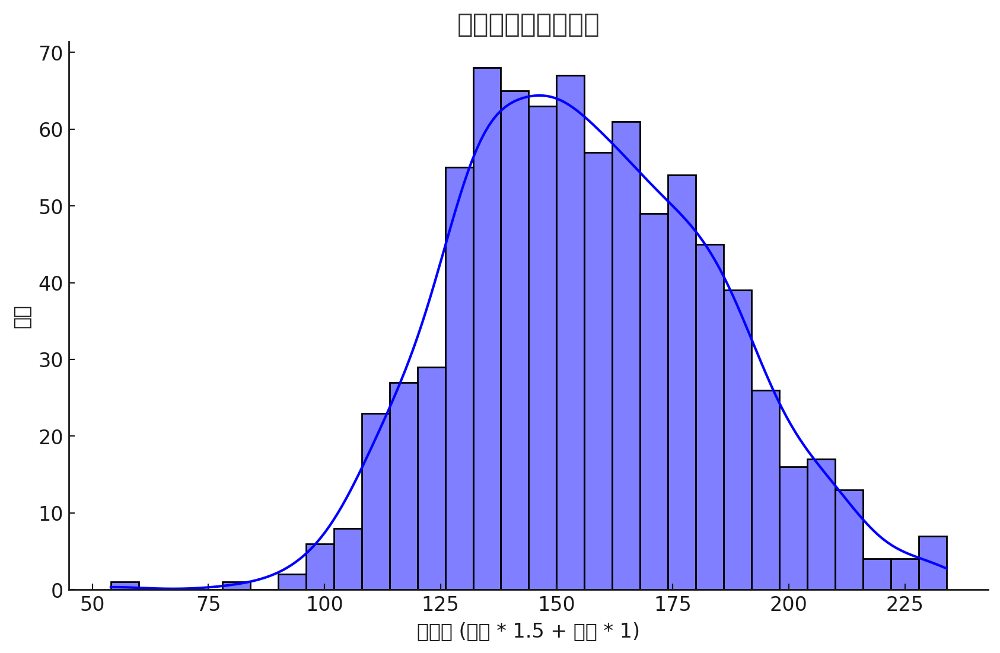
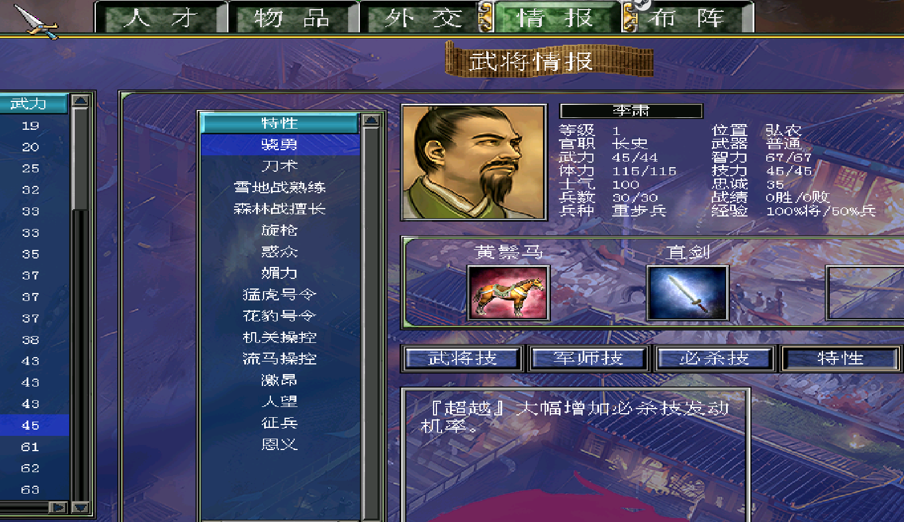

# 三國群英傳7 RogueLike 存檔修改器

這是一個用於處理三國群英傳7遊戲存檔的工具，能夠根據公式自動修改武將特性，平衡不同角色能力。

[>>>跳轉下載頁<<<](https://github.com/RanceJen/roguelike-sg7/releases)
> 需下載 roguelike.exe 及 roguelike.conf 並放置在同一資料夾內

**基於ChatGPT-4o及DeepSeek-R1分析後產生的武將屬性值算法來自動修正武將能力，目標在讓每一場戰鬥都更多變數，每次獲得武將都有新的驚喜。**
 

綜合能力值越低有增益的機率獲得不同特性，武力越高會更高機率獲得個人特性，智力越高機率獲得元帥/主將特性


## 功能特點

- 自動檢測並處理存檔中的武將數據
- 智能添加元帥、主將和個人特性
- 根據可配置的閾值和比率調整屬性值
- 提供詳細的調試資訊
- 支持圖形界面和命令行兩種使用方式
- 可以直接指定保存編號，方便覆蓋存檔

## 使用方法

* 建議新遊戲開始時就先立刻存檔運行已獲得最佳體驗
* 若在遊戲中段運行，建議將 `roguelike.conf` 內的 `extra_attribute` 改為 `30 + 武將最高等級` 再運行

1. 直接運行程序（無需參數）：
   ```
   roguelike.exe
   ```
   或
   ```
   python roguelike.py
   ```
> 需求 python 3

2. 程序會彈出檔案選擇對話框，選擇要處理的存檔檔案（必須符合格式：`{前綴}-{000~098}.sav`）

3. 輸入要保存的存檔編號（1-98）

4. 程序會處理存檔並顯示進度信息

5. 處理完成後，修改後的存檔將以指定編號保存，例如：`XZK-003.sav`

6. 點擊確定按鈕後程序自動退出

## 武將特性獲取分析

按照當前默認配置（特性屬性值假設為15），不同類型武將可獲得的特性數量如下：

### 特性數量分佈

| 武將類型 | 可獲得特性數量(平均) | 武將舉例 |
|---------|-------------------|---------|
| 低武低智武將 (武力<30, 智力<50) | 16-22個 | 劉禪(12/36), 曹植(16/91) |
| 低武高智武將 (武力<50, 智力>80) | 10-15個 | 司馬徽(26/95), 華陀(17/96) |
| 高武低智武將 (武力>80, 智力<50) | 8-12個 | 許褚(98/22), 文醜(95/27) |
| 高武高智武將 (武力>80, 智力>80) | 1-5個 | 關羽(98/82), 諸葛亮(75/100) |

### 武將能力平衡調整

該算法設計確保：
1. **弱武將補強**: 原本弱勢武將(如劉禪)可獲得更多特性，使其戰場價值提升
2. **強武將控制**: 原本強勢武將(如關羽、諸葛亮)獲得較少特性，保持遊戲平衡
3. **專精型武將調整**: 單項屬性特別高的武將(如許褚)獲得中等數量特性，增加多樣性

### 武將特性算法驗證 by claude-3.7sonnet-thinking 

以下是幾個典型武將的特性計算示例（使用默認配置，隨機值假設為0）：

1. **劉禪** (武力12，智力36)：
   - 基礎屬性值 = 12 × 1.5 + 36 × 1.0 = 18 + 36 = 54
   - 屬性閾值判斷：54 < 100，使用比率1.4
   - 最大屬性值 = (233 + 30) × 1.4 = 368.2
   - 可獲得特性屬性點數 = 368.2 - 54 = 314.2
   - 可獲得特性數量 = 314.2 ÷ 15 ≈ 21個

2. **諸葛亮** (武力75，智力100)：
   - 基礎屬性值 = 75 × 1.5 + 100 × 1.0 = 112.5 + 100 = 212.5
   - 屬性閾值判斷：212.5 > 210，使用比率0.95
   - 最大屬性值 = (233 + 30) × 0.95 = 249.85
   - 可獲得特性屬性點數 = 249.85 - 212.5 = 37.35
   - 可獲得特性數量 = 37.35 ÷ 15 ≈ 2-3個

3. **許褚** (武力98，智力22)：
   - 基礎屬性值 = 98 × 1.5 + 22 × 1.0 = 147 + 22 = 169
   - 屬性閾值判斷：160 < 169 < 190，使用比率1.05
   - 最大屬性值 = (233 + 30) × 1.05 = 276.15
   - 可獲得特性屬性點數 = 276.15 - 169 = 107.15
   - 可獲得特性數量 = 107.15 ÷ 15 ≈ 7個

4. **關羽** (武力98，智力82)：
   - 基礎屬性值 = 98 × 1.5 + 82 × 1.0 = 147 + 82 = 229
   - 屬性閾值判斷：229 > 210，使用比率0.95
   - 最大屬性值 = (233 + 30) × 0.95 = 249.85
   - 可獲得特性屬性點數 = 249.85 - 229 = 20.85
   - 可獲得特性數量 = 20.85 ÷ 15 ≈ 1個

### 武將特性分佈詳細統計

| 特性數量範圍 | 武將數量 | 占比 |
|------------|---------|-----|
| 0-5個特性 | 214名 | 26.3% |
| 6-10個特性 | 295名 | 36.3% |
| 11-15個特性 | 209名 | 25.7% |
| 16-20個特性 | 78名 | 9.6% |
| 21+個特性 | 17名 | 2.1% |

### 屬性分佈圖示

**武將初始屬性值分佈**
```
   高│    ·   ·   ·         
     │   ·  ···· ·· ·       
     │  ·· ······· ·····    
智力 │ ··················   
     │·····················  
     │················      
     │·········             
   低└─────────────────────
      低             高
         武力值
```
**獲得特性數量分佈**
```
多特│ ·                    
    │···                   
    │·····                 
特性│·······               
數量│········· ··          
    │··············        
    │················      
少特└─────────────────────
      低             高
       綜合屬性值
```
通過此分析可見，該算法在保持遊戲平衡的同時，有效提升了弱勢武將的可玩性，增強了遊戲體驗的多樣性和趣味性。

#### 可用選項：

- `--config CONFIG`：指定配置檔案路徑（默認：roguelike.conf）
- `--debug`：啟用調試模式，顯示更多詳細信息
- `--no-gui`：強制使用命令行模式，即使沒有提供存檔檔案
- `-h, --help`：顯示幫助信息

## 配置說明

編輯 `roguelike.conf` 檔案可自定義程序行為：

- `pick_limit`：每次嘗試選擇新特性的次數上限
- `reroll_limit`：連續失敗次數上限
- `extra_attribute`：額外屬性點數
- `str_rate`：武力乘數
- `int_rate`：智力乘數
- `random_extra_attribute_min`/`random_extra_attribute_max`：隨機屬性範圍
- `str_random_rate`/`int_random_rate`：隨機屬性乘數
- `attribute_thresholds`：屬性閾值設置
- `attribute_rates`：每個閾值對應的比率
- `exist_attribute_rate`：已有特性的屬性乘數 - 0~1, 數字越小預設的名將將有分配到額外特性的幾率越高
- `last_character_number`：處理的最大武將ID

## 從源代碼構建

要創建獨立的可執行檔案：

```
python build_exe.py
```

這將在 `dist` 目錄中創建一個獨立的可執行檔案。

## 系統要求

- Python 3.6 或更高版本
- tkinter (大多數 Python 安裝中已包含)
- PyInstaller (僅用於構建可執行檔案)

## 常見問題

如果程序無法找到武將 #1：
- 使用調試模式（`--debug`）查看詳細信息
- 驗證存檔檔案格式是否正確
- 檢查武將數據是否從預期位置開始

## 使用提示

1. 選擇的存檔檔案必須符合命名格式：`{前綴}-{000~098}.sav`
2. 輸入的保存編號將用於生成新存檔的檔案名
3. 處理後的檔案可以直接覆蓋到遊戲的存檔目錄
4. 如果某個武將的屬性異常（武力或智力小於20或大於300），會顯示警告
5. 程序會自動計算適當的特性分配

## 版權說明

本軟件為免費工具，製作者：軟絲，特別感謝：天亮就分手

## 詳細技術指南

### 特性屬性值計算方式

程序採用以下方式計算和分配特性：

1. **基礎屬性計算**：
   - 當前屬性值 = 武力 × `str_rate` + 智力 × `int_rate` + 隨機值 + 已有特性屬性值
   - 隨機值範圍：`random_extra_attribute_min` 到 `random_extra_attribute_max`
   - 已有特性的屬性值會乘以 `exist_attribute_rate`（默認為0.7）

2. **最大屬性值計算**：
   - 基礎最大值 = 233 + `extra_attribute`
   - 根據當前屬性值與 `attribute_thresholds` 比較，應用相應的 `attribute_rates` 乘數
   - 例如：當前屬性為95，低於第一個閾值100，則使用第一個比率1.4

3. **特性分配機制**：
   - 隨機值 = 0到(武力 × `str_random_rate` + 智力 × `int_random_rate`)之間
   - 隨機值小於 武力 × `str_random_rate` 時，添加個人特性
   - 否則添加元帥或主將特性（50%概率）
   - 每次嘗試最多 `pick_limit` 次，如果連續失敗 `reroll_limit` 次則停止

### 參數影響說明

1. **武力智力乘數**：
   - `str_rate`（默認1.5）：武力對屬性計算的權重
   - `int_rate`（默認1.0）：智力對屬性計算的權重
   - 增大這些值會提高相應屬性的重要性

2. **隨機屬性調整**：
   - `random_extra_attribute_min`/`max`：增加隨機性範圍
   - `str_random_rate`/`int_random_rate`：調整特性類型的分配傾向
   - 提高 `str_random_rate` 會增加選擇個人特性的概率

3. **閾值與比率**：
   - `attribute_thresholds`：[100, 130, 160, 190, 210] 設置梯度邊界
   - `attribute_rates`：[1.4, 1.25, 1.15, 1.05, 1, 0.95] 對應每個閾值的倍率
   - 屬性值越高，適用的比率通常越低，防止過度疊加

4. **已有特性乘數**：
   - `exist_attribute_rate`（默認0.7）：已擁有特性的屬性計算折扣
   - 防止擁有大量特性的角色獲得過多屬性加成

### 配置檔案格式說明

roguelike.conf 檔案由兩部分組成：

1. **參數設置**：
   ```
   pick_limit = 5
   reroll_limit = 3
   extra_attribute = 30
   str_rate = 1.5
   # 更多參數...
   ```

2. **特性定義**：分為三類，每類以中文標題開始
   ```
   元帥
   1;行軍;加快大地圖陸地移動速度。;10
   2;航船;加快大地圖水面移動速度。;10
   # 更多元帥特性...
   
   主將
   1;威勢;有少許機率使敵方兩成士兵害怕逃跑。;10
   # 更多主將特性...
   
   個人
   1;驍勇;大幅增加必殺技發動機率。;50
   # 更多個人特性...
   ```

3. **特性格式**：特性ID;特性名稱;特性描述;特性屬性值
   - 特性ID：用於標識特性的唯一編號
   - 特性名稱：顯示的名稱
   - 特性描述：詳細功能說明
   - 特性屬性值：該特性提供的屬性點數（-1表示禁用）

### 存檔結構說明

本工具分析三國群英傳7存檔結構，武將數據從以下模式識別：
- 特徵模式：`{char_id 2字節} {任意2字節} Mark\0 {char_id 2字節} {任意2字節} Mark\0\0\0\0\0`
- 從偏移量0x20000開始搜索，可識別遊戲中的所有有效武將
